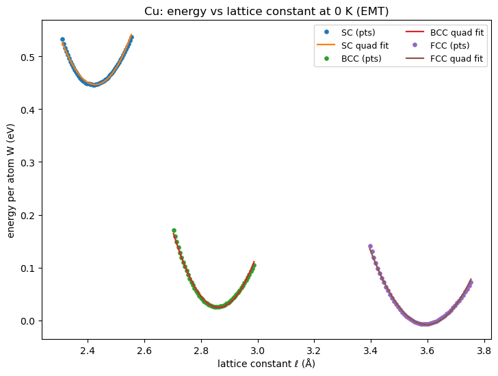
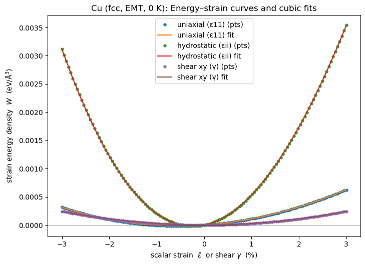
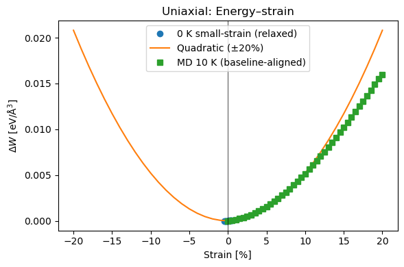
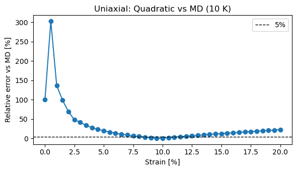
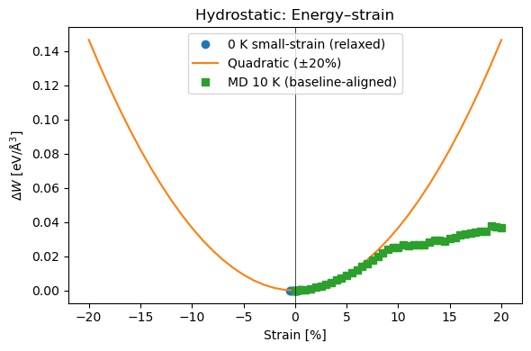
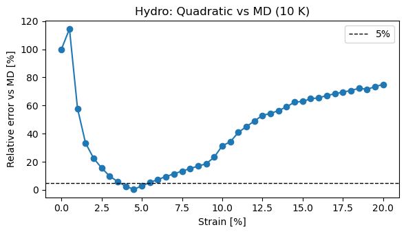
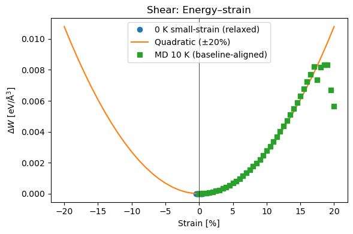
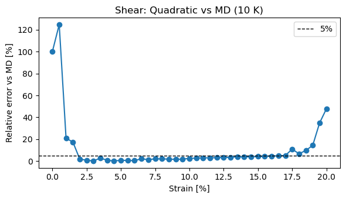

# Atomistic Simulation of fcc Cu — Lattice Parameter & Elastic Constants

**Course:** Materials Simulation Practical | FAU Erlangen-Nürnberg  
**Tools:** Python · ASE · EMT potential · NumPy · SciPy · Matplotlib

📄 [Full written report](report.pdf) | 💻 [Jupyter notebook](atomistic_simulation_Cu.ipynb)

---

## Overview

Atomistic simulation of copper (Cu) using the Effective Medium Theory (EMT)
interatomic potential. The project has three parts: determining the equilibrium
lattice parameter across SC, BCC, and FCC crystal structures; extracting all
three independent elastic constants via energy-strain analysis; and quantifying
the strain range over which linear elasticity remains valid by comparison with
finite-temperature molecular dynamics.

---

## Task 3.2 — Equilibrium Lattice Parameter

Energy per atom scanned as a function of lattice constant for SC, BCC, and FCC
structures using a two-stage coarse/fine grid with quadratic fitting to locate
each minimum precisely.



| Structure | ℓ₀ (Å) | W₀ (eV/atom) |
|-----------|--------|--------------|
| SC        | 2.4265 | +0.446       |
| BCC       | 2.8622 | +0.024       |
| **FCC**   | **3.5978** | **−0.008** |

FCC is the ground-state structure. The computed lattice parameter deviates from
the experimental value (3.615 Å) by **−0.48%**.

---

## Task 3.5 — Elastic Constants via Energy-Strain

Three independent strain paths applied to the relaxed FCC reference cell:
uniaxial (ε₁₁), hydrostatic (εᵢᵢ), and shear (γ). The curvature of each
strain energy density curve gives a combination of elastic constants, from
which C₁₁, C₁₂, and C₄₄ are extracted analytically.



| Constant | Computed (10¹¹ N/m²) | Literature | Error  |
|----------|----------------------|------------|--------|
| C₁₁      | 1.7166               | 1.7620     | −2.6%  |
| C₁₂      | 1.1617               | 1.2494     | −7.0%  |
| C₄₄      | 0.8684               | 0.8177     | +6.2%  |

All three constants are within ~7% of experimental values, consistent with the
known accuracy limits of the EMT potential.

---

## Task 3.6 — Validity of Linear Elasticity

The small-strain quadratic approximation (fitted at ±0.5%) is extrapolated to
±20% and benchmarked against NVT Langevin MD at 10 K. Validity is defined as
≤5% relative error between the quadratic model and MD.

| Deformation Mode | Linear elasticity valid up to |
|-----------------|-------------------------------|
| Uniaxial        | ~11.5%                        |
| Hydrostatic     | ~5.0%                         |
| Shear           | ~16.5%                        |

### Uniaxial




### Hydrostatic




### Shear




Hydrostatic loading breaks down earliest (~5%), reflecting strong volumetric
nonlinearity in the EMT potential. Shear deformation remains within the linear
regime to the largest strains (~16.5%), consistent with the relatively flat
off-diagonal energy landscape in close-packed metals. The large relative errors
visible near ε = 0 in the error plots are a numerical artifact of near-zero
division — absolute errors at those strains are negligible.

---

## Requirements
```bash
pip install ase numpy matplotlib scipy
```

---

## Usage

Open `atomistic_simulation_Cu.ipynb` in Jupyter and run cells sequentially. Tasks 3.5
and 3.6 depend on the `results` dictionary populated in Task 3.2. Task 3.6 runs
Langevin MD across 123 strain points — expect approximately 30 minutes on a
standard laptop.
